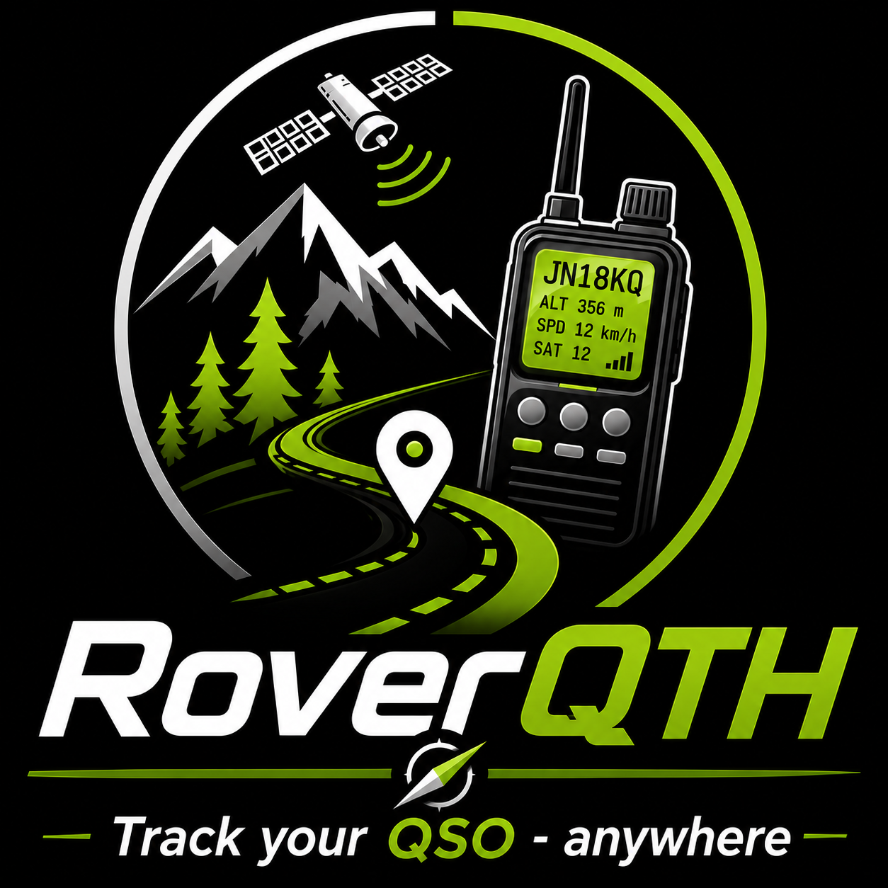

<p align="center">
  
</p>

<p align="center">
  
  
  
  
  
  
  
  
</p>

<p align="center">
  <strong>GNSS Assistant for Portable & Mobile Amateur Radio</strong>
</p>

RoverQTH is a standalone GNSS assistant designed for portable and mobile amateur radio operations. Built around the ESP32 platform, it provides a dedicated touchscreen interface displaying real-time GNSS position, Maidenhead locator and operating information, allowing operators to accurately determine their current operating position in the field.

The project runs on compact portable hardware featuring an ESP32 microcontroller, a u-blox GNSS receiver and a 4-inch ST7796S touchscreen. It also provides persistent QTH session recording and onboard event logging, simplifying post-operation analysis and laying the foundation for future synchronization with the RoverQTH web platform and desktop tools.

---

## Features

### GNSS Positioning

* u-blox GNSS receiver support
* Automatic GNSS acquisition during startup
* GNSS acquisition progress indicator
* Automatic acquisition recovery on timeout
* Real-time position updates

### Maidenhead Locator

* Maidenhead locator computation
* Large locator display optimized for field use
* Automatic locator updates from GNSS position

### GNSS Information Display

* Latitude
* Longitude
* Speed
* Heading
* Altitude (ASL)
* Fix status
* Satellite count
* HDOP precision indicator

### Touchscreen Interface

* 4-inch ST7796S display support (clone)
* Persistent touchscreen calibration
* Independent NORMAL and REVERSED calibration profiles
* Runtime screen rotation support
* On-device recalibration from the Settings menu
* Optimized landscape interface
* Embedded fonts and graphical resources
* On-device display configuration

### System Features

* Boot status screen
* Settings menu
* Modular settings page framework
* Network configuration page (WiFi)
* Operational WiFi connectivity
* Persistent configuration storage
* SD card initialization
* Persistent SD card storage
* Automatic SD directory management
* Persistent QTH recording (JSONL)
* System event logging
* Error logging
* Battery monitoring
* Battery profile configuration
* GNSS-synchronized UTC system clock
* Real-time UTC header clock
* OTA firmware updates
* Online firmware version checking

### Power Management

* Battery voltage monitoring
* Battery percentage estimation
* Battery presence detection
* Configurable battery capacity
* Configurable minimal, nominal and maximal battery voltage
* Configurable voltage divider ratio (High / Low)
* Dynamic low and critical battery thresholds

---

## QTH Recording

RoverQTH records operating locations as independent QTH sessions.
Each session is stored as a single JSON object using the JSONL format and contains:

* Start position
* Stop position
* UTC timestamps
* Maidenhead locators
* Altitude
* Duration
* Air-line distance

QTH sessions are stored in JSONL format to simplify post-processing and third-party software development.

---

## Storage

The directory structure is automatically created during SD card initialization.
RoverQTH stores its persistent data on the SD card using a dedicated directory structure.

```text
/RoverQTH/
├── database/
├── export/
├── logs/
│   ├── system.log
│   └── error.log
├── qth/
│   └── QTH.jsonl
└── tmp/     ← temporary files/downloads
```

### Logging

Two log files are automatically maintained.

* `system.log`
  * System events
  * Boot sequence
  * QTH recording events
  * OTA update events

* `error.log`
  * Initialization failures
  * Storage failures
  * Runtime errors

Logs are automatically timestamped using:

* Boot-relative timestamps before GNSS synchronization
* ISO 8601 UTC timestamps maintained by the synchronized system clock

---

## OTA Firmware Updates

RoverQTH supports secure over-the-air firmware updates directly from the Settings menu.
Firmware updates are performed directly to the OTA partition using secure HTTPS streaming and do not require temporary firmware storage on the SD card.

The OTA system provides:

* Automatic firmware version checking
* Firmware manifest validation
* Secure HTTPS downloads
* SHA-256 firmware integrity verification
* Download progress display
* Automatic installation
* Automatic reboot after successful update
* Detailed error reporting

Firmware updates are performed asynchronously without blocking the user interface.

## Hardware Requirements

### Supported Controller

* Arduino Nano ESP32

### Supported GNSS Module

* u-blox M8 compatible receiver

### Supported Display

* ST7796S 480×320 touchscreen display (clone)
* MSP4020 / MSP4021 compatible hardware

### Supported SD Reader

* SPI SD card reader

### Supported Battery

* 1S LiPo battery (3.7 V nominal, 4.2 V max)

### Battery Monitoring

* Analog battery monitoring input
* External voltage divider required

---

## Tested Hardware

The following hardware was used during RoverQTH development and testing.

Using the same components is recommended to ensure identical behavior and compatibility.

### Controller

- Arduino Nano ESP32
- Kubii: [Arduino Nano ESP32](https://www.kubii.com/fr/cartes-micro-controleurs/4174-arduino-nano-esp32-avec-header-3272496324718.html)

### GNSS Receiver

- u-blox GNSS module
- Amazon: [GPS-GPSV3 NEO-M8N](https://www.amazon.fr/dp/B0F98669J9)

### Display

- MSP4021 4-inch 480×320 ST7796S touchscreen display
- Amazon: [4" LCD TFT Touch Display Binghe](https://www.amazon.fr/dp/B0CZRV3Q8T)

### SD Reader
- SPI Memory card reader
- Amazon: [Memory Card Module Shield](https://www.amazon.fr/dp/B077MB17JB)

### Battery

- 1S LiPo 3.7V 3000mAh
- Kubii: [Batterie 3000mAh Li-Po](https://www.kubii.com/fr/alimentations-protections/4913-batterie-3000mah-li-po-3272496324541.html)

---

## Dependencies

### GNSS

SparkFun u-blox GNSS Arduino Library

Version:

* v2.2.28

Repository:

* https://github.com/sparkfun/SparkFun_u-blox_GNSS_Arduino_Library

### Display

ST7796 MSP4020/MSP4021 Display Library

Version:

* v1.3.8

Repository:

* https://github.com/DeathManOne/Screen-4inch-320x480-ST7796---MSP4020-and-MSP4021

### SD Card

SDCard Library

Version:

* v2.0.0

Repository:

* https://github.com/DeathManOne/SDCard.git#2.0.0

### OTA

Uses the built-in ESP32 Arduino Core Update library.

---

## Installation

### PlatformIO

Add the library to your project and install the required dependencies.

Example:

```ini
lib_deps =
    https://github.com/DeathManOne/RoverQTH
```

---

## Configuration

The project uses compile-time configuration through PlatformIO build flags.

Example configuration:

```ini
-D DL_FIRMWARE="https://github.com/DeathManOne/RoverQTH/releases/latest/download/firmware.bin"
-D DL_FIRMWARE_MANIFEST="https://github.com/DeathManOne/RoverQTH/releases/latest/download/update.json"

-D GPS_RX=2
-D GPS_TX=3
-D GPS_BAUD=38400

-D SD_CS=4
-D SD_MOSI=5
-D SD_MISO=6
-D SD_CLK=7

-D TFT_TOUCH_CS=8
-D TFT_SCREEN_CS=9
-D TFT_SCREEN_DC=10
-D TFT_SCREEN_RST=-1

-D TFT_MOSI=11
-D TFT_MISO=12
-D TFT_CLK=13

-D TFT_WIDTH=480
-D TFT_HEIGHT=320

-D BATT_PIN=17
```

---

## Usage

Initialize the RoverQTH library from your application and call the main processing loop continuously.

```cpp
#include <RoverQTH.h>

void setup() {
    RoverQTH::setup();
}

void loop() {
    RoverQTH::loop();
}
```

---

## Roadmap

Implemented features:

* GNSS positioning
* Maidenhead locator display
* GNSS information display
* Touchscreen interface
* Persistent touchscreen calibration
* Dual calibration profiles (NORMAL / REVERSED)
* Runtime screen rotation support
* Callsign customization
* Callsign suffix support
* Metric / Imperial units support
* Boot status screen
* NVS configuration storage
* Battery voltage monitoring
* Battery percentage estimation
* Battery presence detection
* Settings menu
* Configurable battery profile
* Battery voltage divider configuration
* Dynamic battery low/critical thresholds
* GNSS UTC clock synchronization
* Network configuration page (WiFi)
* Operational WiFi connectivity
* OTA firmware updates
* Online firmware update system
* Persistent SD storage
* Persistent QTH session recording
* JSONL export format
* Automatic SD directory management
* Persistent system logging with automatic timestamps

Planned features:

* SOTA database support
* POTA database support
* OTA database updates (SOTA / POTA)
* Export utilities
* SOTA navigation
* Storage actions (export, clear logs)
* Power button / Deep sleep

---

## License

This project is licensed under the GNU General Public License v3.0 or later (GPL-3.0-or-later).

See the LICENSE file for complete license information.

---

## Author

DeathManOne

GitHub:
https://github.com/DeathManOne

Project:
https://github.com/DeathManOne/RoverQTH
